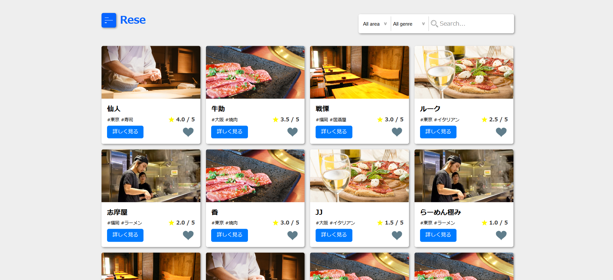
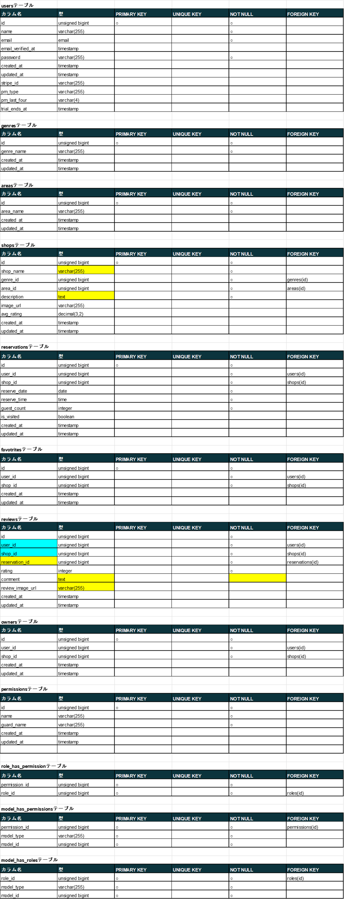
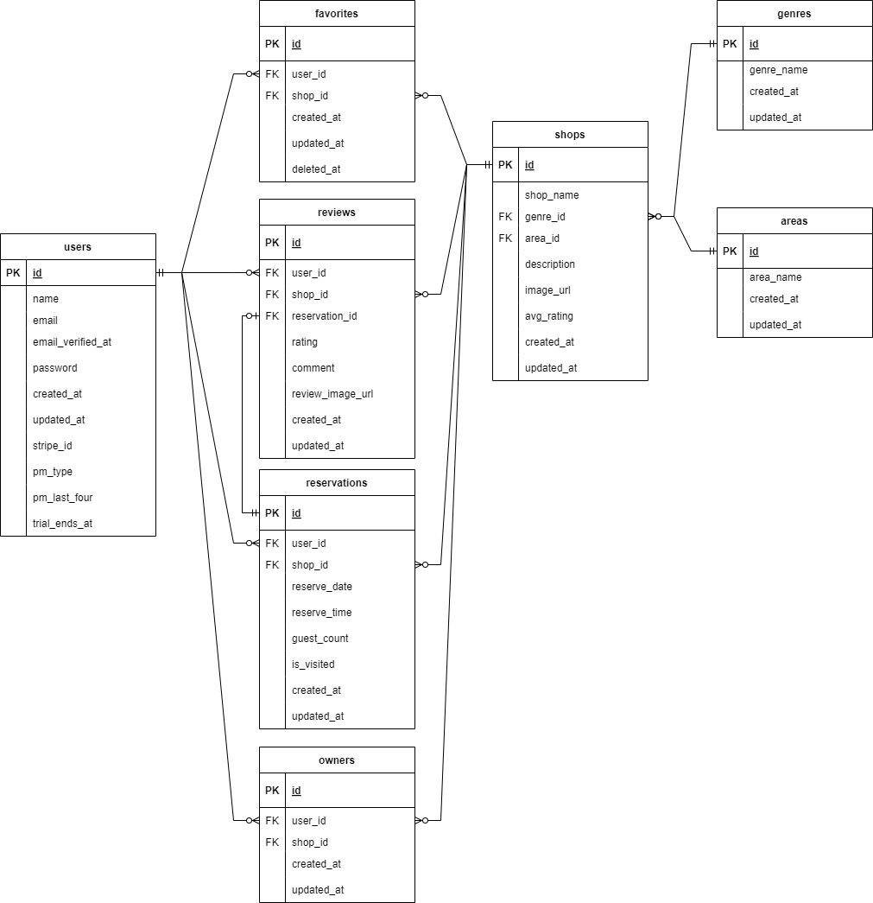

# ReseRese(勤怠管理アプリ)
勤怠管理アプリです。

## 作成した目的
クライアント企業からの、人事評価用の勤怠管理システム構築を想定し、
実践に近い形での開発過程をアウトプットとして記録するため作成しました。

## URL
- 開発環境ホーム：http://localhost/
- 開発環境ユーザー一覧ページ：http://localhost/users
- phpMyAdmin：http://localhost:8080/
- MailHog：http://localhost:8025/
- 本番環境ホーム：http://54.65.247.104/
- 本番環境ユーザー一覧ページ：http://54.65.247.104/users
- 本番環境 phpMyAdmin：http://54.65.247.104:8080/
- 本番環境 MailHog：http://54.65.247.104:8025/

## 使用技術(実行環境)
- PHP8.3.9
- Laravel8.83.27
- MYSQL8.0.26

## 機能一覧
会員登録、ログイン、ログアウト、ユーザー情報取得、ユーザー飲食店お気に入り一覧取得、  
ユーザー飲食店予約情報取得、飲食店一覧取得、飲食店詳細取得、飲食店お気に入り追加、  
飲食店お気に入り削除、飲食店予約情報追加、飲食店予約情報削除、エリアで検索する、  
ジャンルで検索する、店名で検索する、予約変更機能、評価機能、バリデーション、管理画面、  
ストレージ、認証、メール送信、リマインダー、QRコード、決済機能  

## 環境構築
**Dockerビルド**
1. リポジトリからクローン
```bash
git clone git@github.com:eto0831/reservation-2.git
```
2. リポジトリの設定(必要であれば)
```bash
git remote set-url origin git@github.com:eto0831/reservation-x.git
```
3. サブモジュールの更新(プロジェクトのルートディレクトリで)
```bash
git submodule update --init --recursive
```
4. DockerDesktopアプリを立ち上げる
5. ドッカーのビルド  
※この時点ではjobsテーブル等がないため、警告が出る場合がありますがそのまま進めてください。  
```bash
docker-compose up -d --build
```
**Laravel環境構築**
1. コンテナに入る
```bash
docker-compose exec php bash
```
2. コンポーザーのインストール  
※この時点ではjobsテーブル等がないため、警告が出る場合がありますがそのまま進めてください。  
```bash
composer install
```
3. 「.env.example」ファイルを 「.env」ファイルに命名を変更。または新しく「.env」ファイルを作成
```bash
cp .env.example .env
```
4. .envに以下の環境変数を追加
``` text
APP_NAME=Rese

BASE_URL=http://localhost/storage

DB_CONNECTION=mysql
DB_HOST=mysql
DB_PORT=3306
DB_DATABASE=laravel_db
DB_USERNAME=laravel_user
DB_PASSWORD=laravel_pass

QUEUE_CONNECTION=database

MAIL_MAILER=smtp
MAIL_HOST=mailhog
MAIL_PORT=1025
MAIL_USERNAME=null
MAIL_PASSWORD=null
MAIL_ENCRYPTION=null
MAIL_FROM_ADDRESS=test@example.com
MAIL_FROM_NAME="${APP_NAME}"

STRIPE_KEY=pk_test_から始まるキー
STRIPE_SECRET=sk_test_から始まるキー
```

6. アプリケーションキーの作成
``` bash
php artisan key:generate
```

7. マイグレーションの実行
``` bash
php artisan migrate
```

8. シーディングの実行
``` bash
php artisan db:seed
```
9. シンボリックリンクの作成
```bash
php artisan storage:link
```
10.  PHPコンテナを出る
```bash
exit
```
11. ドッカーを落とす
```bash
docker-compose down
```
12. 再ビルド
```bash
docker-compose up -d --build
```


## テーブル設計


## ER図


## テストアカウントおよび確認ができるサンプルケース
シーディングを実行すると下記アカウントおよびデータの作成が行われます。

## ユーザー一覧
1. 管理者　　　email: popo1@example.com
2. 店舗代表者　email: popo2@example.com ※"shop_id:21(店名：test)と22(店名：test2)"の代表者
3. 一般ユーザー　　email: popo3@example.com  ※お気に入り情報のみランダムで設定済み
4. 一般ユーザー　　email: popo5@example.com  ※レビュー関連操作確認用
5. 一般ユーザー　　email: popo7@example.com  ※レビュー関連操作確認用
6. 一般ユーザー　　email: popo8@example.com  ※予約関連操作確認用

メールアドレス：popo1@example.com ～ popo8@example.com  
各ユーザー名：@の前の部分(例：popo1@example.comの場合は popo1)  
パスワード：popo1212 （共通）  

### ロールによる管理画面ダッシュボードへのアクセス
管理者および店舗代表者はログイン後、ハンバーガーボタンを押すと表示される、「Admin」、または「Owner」のリンクをクリックしてください。  
管理者は管理者ページ内の店舗代表者作成、店舗代表者情報管理、お知らせメール機能、  
店舗代表者は店舗代表者ページ内の店舗情報作成、店舗情報編集、予約情報管理、来店確認機能から各機能をご確認ください。  

### 店舗での予約QR読み取りによる、予約情報および来店確認について
popo2@example.com(店舗代表者)のアカウントで、店舗代表者ページからの「来店確認機能」へお進みください。  
ユーザーはマイページのQRコードマークからQRを表示し、店舗代表者は</reservation/scan>で起動されるカメラから予約QRを読み込んでください。  
PCが一台の場合はQRをスマホ等で撮影し、PCのWEBカメラにと読ませてください。  
その後、予約照合画面で、予約を確認ボタンを押してください。  
※注意 この操作をすることで、ユーザーは来店した店舗へのレビュー評価が可能になります。  

AWS上で予約照合する際、カメラのアクセスを許可するため、下記URLにアクセスして設定を変更してください。（クロームをご使用ください。）  
その他のブラウザでは下記手順と同様の操作をご確認の上、実施してください。  
<chrome://flags/>  
Insecure origins treated as secureで検索  
<http://13.112.70.71/reservation/scan>  
を入力しタブを停止中から有効に変更し。再起動ボタンを押し、クロームを再起動してください。  
再起動後カメラの許可を求められますので許可してください。  

## 注意事項
もし店舗画像がない、または表示されない場合は、  
<https://reservation-aws-bucket-eto0831.s3.ap-northeast-1.amazonaws.com/images/shops/>  
より全てダウンロードし、src/storage/app/public/images/shopsを作成の上、フォルダ内に画像を保存してください。  
