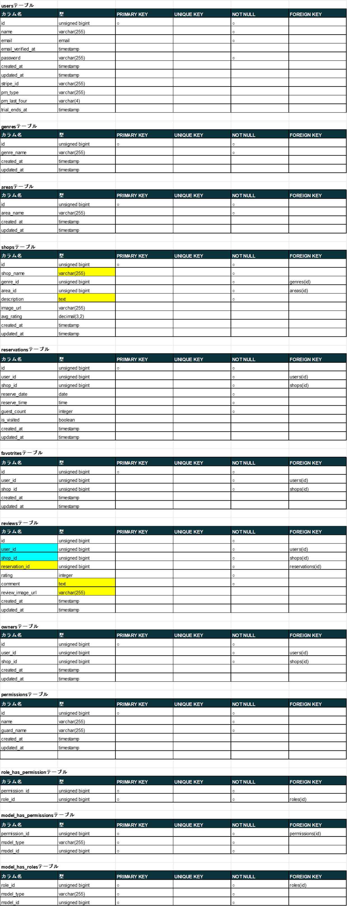
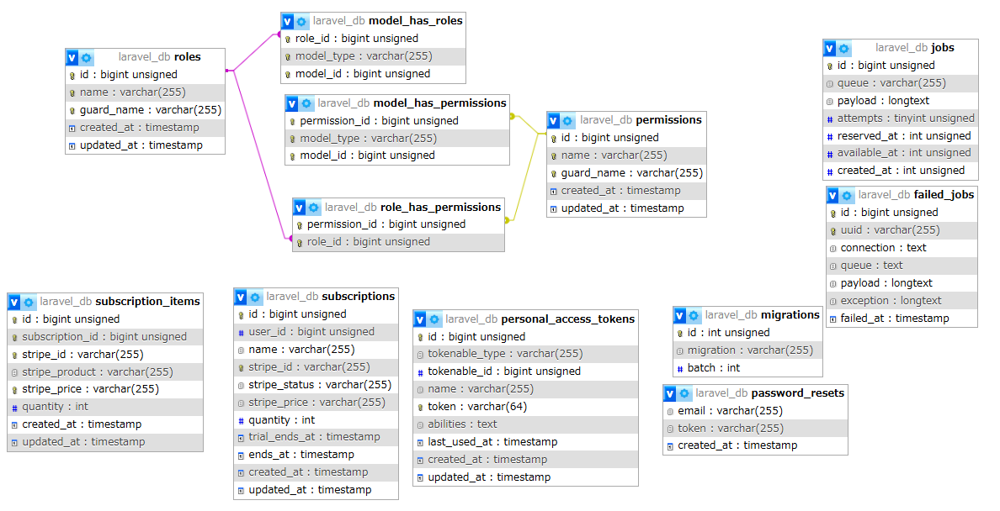

# ReseRese(勤怠管理アプリ)
勤怠管理アプリです。

## 作成した目的
クライアント企業からの飲食店予約システム構築の依頼を想定し、
実践に近い形での開発過程を体験するために作成しました。

## URL
- 開発環境ホーム：http://localhost/
- 開発環境ユーザー一覧ページ：http://localhost/users
- phpMyAdmin：http://localhost:8080/
- MailHog：http://localhost:8025/
- 本番環境ホーム：http://13.112.70.71/
- 本番環境 MailHog：http://13.112.70.71:8025/

## 使用技術(実行環境)
- PHP8.3.9
- Laravel8.83.27
- MYSQL8.0.26

## 機能一覧
会員登録、ログイン、ログアウト、ユーザー情報取得、ユーザー飲食店お気に入り一覧取得、  
ユーザー飲食店予約情報取得、飲食店一覧取得、飲食店詳細取得、飲食店お気に入り追加、  
飲食店お気に入り削除、飲食店予約情報追加、飲食店予約情報削除、エリアで検索する、  
ジャンルで検索する、店名で検索する、予約変更機能、評価機能、バリデーション、管理画面、  
ストレージ、認証、メール送信、リマインダー、QRコード、決済機能  

## 環境構築
**Dockerビルド**
1. リポジトリからクローン
```bash
git clone git@github.com:eto0831/reservation-2.git
```
2. リポジトリの設定(必要であれば)
```bash
git remote set-url origin git@github.com:eto0831/reservation-x.git
```
3. サブモジュールの更新(プロジェクトのルートディレクトリで)
```bash
git submodule update --init --recursive
```
4. DockerDesktopアプリを立ち上げる
5. ドッカーのビルド  
※この時点ではjobsテーブル等がないため、警告が出る場合がありますがそのまま進めてください。  
```bash
docker-compose up -d --build
```
**Laravel環境構築**
1. コンテナに入る
```bash
docker-compose exec php bash
```
2. コンポーザーのインストール  
※この時点ではjobsテーブル等がないため、警告が出る場合がありますがそのまま進めてください。  
```bash
composer install
```
3. 「.env.example」ファイルを 「.env」ファイルに命名を変更。または新しく「.env」ファイルを作成
```bash
cp .env.example .env
```
4. .envに以下の環境変数を追加
``` text
APP_NAME=Rese

BASE_URL=http://localhost/storage

DB_CONNECTION=mysql
DB_HOST=mysql
DB_PORT=3306
DB_DATABASE=laravel_db
DB_USERNAME=laravel_user
DB_PASSWORD=laravel_pass

QUEUE_CONNECTION=database

MAIL_MAILER=smtp
MAIL_HOST=mailhog
MAIL_PORT=1025
MAIL_USERNAME=null
MAIL_PASSWORD=null
MAIL_ENCRYPTION=null
MAIL_FROM_ADDRESS=test@example.com
MAIL_FROM_NAME="${APP_NAME}"

STRIPE_KEY=pk_test_から始まるキー
STRIPE_SECRET=sk_test_から始まるキー
```
※上記STRIPEのキーは所有しているアカウントでの、テストモード用のキーを設定してください。

6. アプリケーションキーの作成
``` bash
php artisan key:generate
```

7. マイグレーションの実行
``` bash
php artisan migrate
```

8. シーディングの実行
``` bash
php artisan db:seed
```
9. シンボリックリンクの作成
```bash
php artisan storage:link
```
10.  PHPコンテナを出る
```bash
exit
```
11. ドッカーを落とす
```bash
docker-compose down
```
12. 再ビルド
```bash
docker-compose up -d --build
```


## テーブル設計


## ER図_1


## ER図_2(Laravel Permission及びSTRIPE等導入時に自動生成されたテーブル)


## テストアカウントおよび確認ができるサンプルケース
シーディングを実行すると下記アカウントおよびデータの作成が行われます。

## ユーザー一覧
1. 管理者　　　email: popo1@example.com
2. 店舗代表者　email: popo2@example.com ※"shop_id:21(店名：test)と22(店名：test2)"の代表者
3. 一般ユーザー　　email: popo3@example.com  ※お気に入り情報のみランダムで設定済み
4. 一般ユーザー　　email: popo5@example.com  ※レビュー関連操作確認用
5. 一般ユーザー　　email: popo7@example.com  ※レビュー関連操作確認用
6. 一般ユーザー　　email: popo8@example.com  ※予約関連操作確認用

メールアドレス：popo1@example.com ～ popo8@example.com  
各ユーザー名：@の前の部分(例：popo1@example.comの場合は popo1)  
パスワード：popo1212 （共通）  

### ロールによる管理画面ダッシュボードへのアクセスとその他注意事項
管理者および店舗代表者はログイン後、ハンバーガーボタンを押すと表示される、「Admin」、または「Owner」のリンクをクリックしてください。  
管理者は管理者ページ内の店舗代表者作成、店舗代表者情報管理、お知らせメール機能、  
店舗代表者は店舗代表者ページ内の店舗情報作成、店舗情報編集、予約情報管理、来店確認機能から各機能をご確認ください。  
※店舗代表者作成機能に関し、店舗代表者の担当店舗がない状態で作成することも可能です。  
  後から管理者アカウントの「店舗代表者情報管理」で、担当店舗を追加や削除をすることが可能です。  
※店舗代表者は新規で店舗情報の作成が可能です。また、画像がない場合は「Noimage」（準備中の意味合いで）の画像が適用されます。  

### 店舗での予約QR読み取りによる、予約情報および来店確認について
popo2@example.com(店舗代表者)のアカウントで、店舗代表者ページから「来店確認機能」へお進みください。  
ユーザーはマイページのQRコードマークからQRを表示し、店舗代表者はPCなどで<http://localhost/reservation/scan>で起動されるカメラから予約QRを読み込んでください。(お手数ですがピントや明るさを調整し読み取ってください。)  
PCが一台の場合はQRをスマホ等で撮影し、PCのWEBカメラに読ませてください。  
その後、予約照合画面で、「予約を確認ボタン」を押してください。  
※注意: この操作をすることで、ユーザーは来店した店舗へのレビュー評価が可能になります。  

AWS上で予約照合する際、カメラのアクセスを許可するため、下記URLにアクセスして設定を変更してください。（クロームをご使用ください。）  
その他のブラウザでは下記手順と同様の操作をご確認の上、実施してください。  
<chrome://flags/>にアクセスし、「Insecure origins treated as secure」で検索  
<http://13.112.70.71/reservation/scan>のアドレスを入力し、タブを停止中から有効に変更、  
その後再起動ボタンを押しクロームを再起動してください。  
再起動後にカメラの許可を求められますので許可してください。  

### csvインポート機能およびcsv記載方法
管理者ログイン後、ハンバーガーボタンを押すと表示される、「Admin」リンクをクリックしてください。  
管理者は管理者ページ内の「csvインポート」へお進みください。  
下記説明要綱を満たしたcsvファイルを選択しアップロードをしてください。  

csvファイルの記載方法は一行目に「shop_name,area_name,genre_name,description,image_url」、  
二行目以降は「テスト店舗,東京都,寿司,テスト店舗説明文,images/shops/sushi.jpg」  
の様に記載し、text形式またはcsv形式にてメモ帳等で保存してください。  
※今回扱えるファイル名はsushi.jpg、yakiniku.jpg、ramen.jpg、italian.jpg、izakaya.jpgのみです。  
新しく画像を足す場合はあらかじめ、src/storage/app/public/images/shopsフォルダに画像を入れ、  
csvファイル内でそのファイル名をsushi.jpg（例）のような形で指定してください。  
- 項目は全て入力必須  
- 店舗名：50文字以内  
- 地域：「東京都」「大阪府」「福岡県」のいずれか  
- ジャンル：「寿司」「焼肉」「イタリアン」「居酒屋」「ラーメン」のいずれか  
- 店舗概要：400文字以内  
- 画像URL：jpg、jpeg、pngのみアップロード可  

（[CSVサンプル](csvサンプル.csv)）参考例はこちらからダウンロードをお願いします。  

### admin（管理者）による口コミ削除
一般ユーザーと同じように、ハンバーガーメニューを押すと現れる「Home」から入り、店舗の「詳しく見る」をクリックしてください。  
店舗詳細画面の「全ての口コミを見る」を選択し、削除対象の口コミを削除してください。


## 注意事項
1. もし店舗画像がない、または表示されない場合は、  
<https://reservation-aws-bucket-eto0831.s3.ap-northeast-1.amazonaws.com/images/shops/italian.jpg>
<https://reservation-aws-bucket-eto0831.s3.ap-northeast-1.amazonaws.com/images/shops/izakaya.jpg>
<https://reservation-aws-bucket-eto0831.s3.ap-northeast-1.amazonaws.com/images/shops/noimage.png>
<https://reservation-aws-bucket-eto0831.s3.ap-northeast-1.amazonaws.com/images/shops/ramen.jpg>
<https://reservation-aws-bucket-eto0831.s3.ap-northeast-1.amazonaws.com/images/shops/sushi.jpg>
<https://reservation-aws-bucket-eto0831.s3.ap-northeast-1.amazonaws.com/images/shops/yakiniku.jpg>  
   より全てダウンロードし、src/storage/app/public/images/shopsのパスでフォルダを作成の上、フォルダ内に画像を保存してください。  
2. メール関連機能に関し、jobとqueue、supervisor等を使用しているため、メールが届くまでに時間差がある場合があります。  
   予定時刻から数分しても届かない場合は、お手数ですがphpコンテナ内で、php artisan queue:restartを実行し再度機能の確認をお願いいたします。  

3. STRIPE決済入力画面ではテストモード決済のため、カード番号に「4242 4242 4242 4242」と、  
   続けて実在しない3桁、かつ、任意のセキュリティーコードをご入力ください。